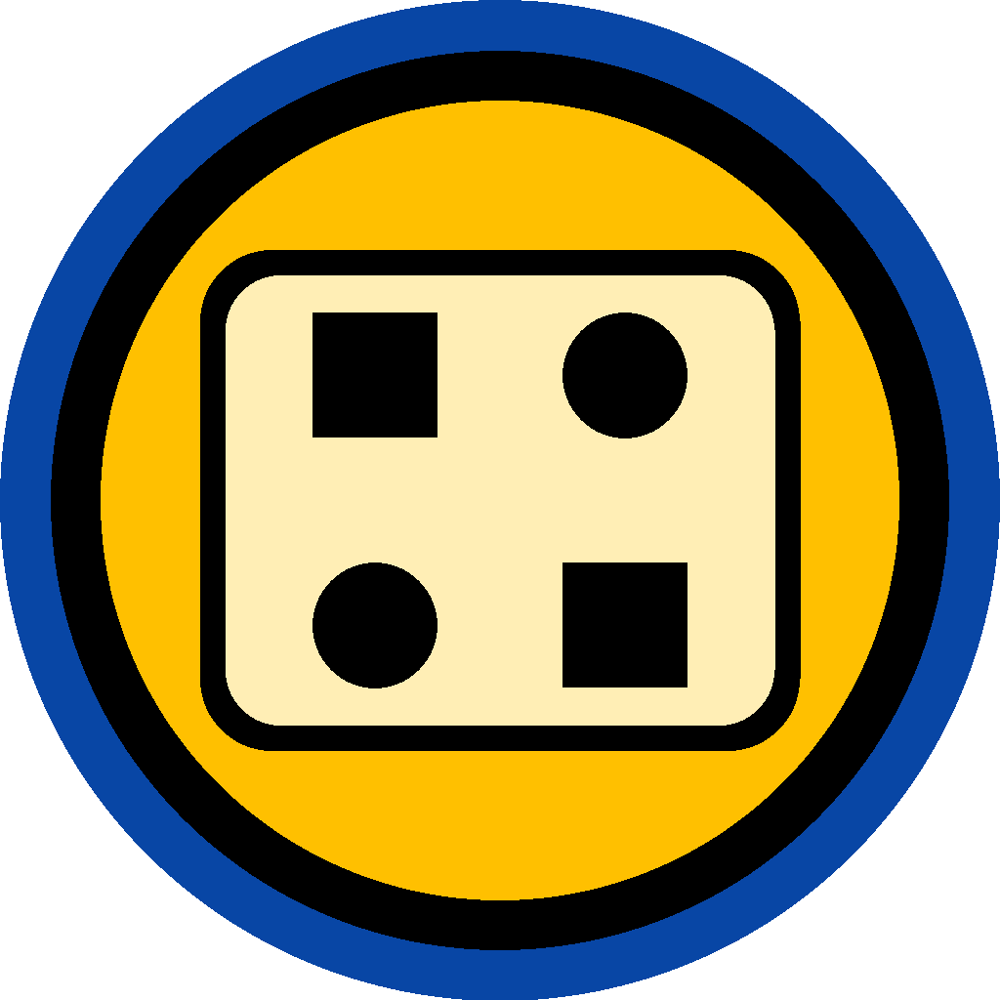

<h1 align="center">
  <br>
  
  <br>
  [MPDisplay]
  <br>
</h1>

<h4 align="center">[Universal Display and Event Drivers for *Python]</h4>

<p align="center">
  <a href="#about">About</a> •
  <a href="#key-features">Key Features</a> •
  <a href="#getting-started">Getting Started</a> •
  <a href="#faq">FAQ</a> •
  <a href="#roadmap">Roadmap</a> •
  <a href="#support">Support</a> •
  <a href="#license">License</a>
</p>

 

## About

Simple overview of use/purpose.

## Key Features

- Feature 1
- Feature 2
  - Feature 2.1
  - Feature 2.2
- Feature 3

## Getting Started

This is an example of how you may give instructions on setting up your project locally. To get a local copy up and running follow these simple example steps.

### Prerequisites

This is an example of how to list things you need to use the software and how to install them.

- npm

### Installing and Running

Below is an example of how you can instruct your audience on installing and setting up your app. This template doesn't rely on any external dependencies or services.

```bash
# Clone this repository
$ git clone https://github.com/[your-github-user]/[your-repository-name]

# Go into the repository
$ cd [your-repository-name]
```

## FAQ

### Is it any good?

[yes.](https://news.ycombinator.com/item?id=3067434)

## Definitions

- This are constraints you give to your project
- Here's another constraint: use this README!

## Roadmap

- [x] Add this README.
- [ ] Finish the unicorn project.

## Emailware

[Project's name] is an [emailware](https://en.wiktionary.org/wiki/emailware). Meaning, if you liked using this app or it has helped you in any way, I'd like you send me an email at <your-email@email.com> about anything you'd want to say about this software. I'd really appreciate it!

## Contributing

If you have a suggestion that would make this better, please fork the repo and create a pull request. You can also simply open an issue with the tag "enhancement".
Don't forget to give the project a star! Thanks again!

1. Fork the project
2. Clone it open the repository in command line
3. Create your feature branch (`git checkout -b feature/amazing-feature`)
4. Commit your changes (`git commit -m 'Add some amazing feature'`)
5. Push to the branch (`git push origin feature/amazing-feature`)
6. Open a pull request from your feature branch from your repository into this repository main branch, and provide a description of your changes

## Support

You can also support us by:

<p align="left">
  <a href="https://www.buymeacoffee.com" target="_blank"></a> &nbsp &nbsp
  <a href="https://www.patreon.com">
    
  </a>
</p>

## License

Your license here.

## Acknowledgments

Inspiration, code snippets, etc.

- [Markdownify's README](https://github.com/amitmerchant1990/electron-markdownify#readme)

## You may also like...

List of apps or libs that do similar stuff as your project.

- [Best-README-Template](https://github.com/othneildrew/Best-README-Template)
- [Simple README.md template](https://gist.github.com/DomPizzie/7a5ff55ffa9081f2de27c315f5018afc)

---

> [hidek.xyz](https://hidek.xyz) &nbsp;&middot;&nbsp;
> GitHub [@abehidek](https://github.com/abehidek) &nbsp;&middot;&nbsp;
> Twitter [@guilhermehabe](https://twitter.com/guilhermehabe)
